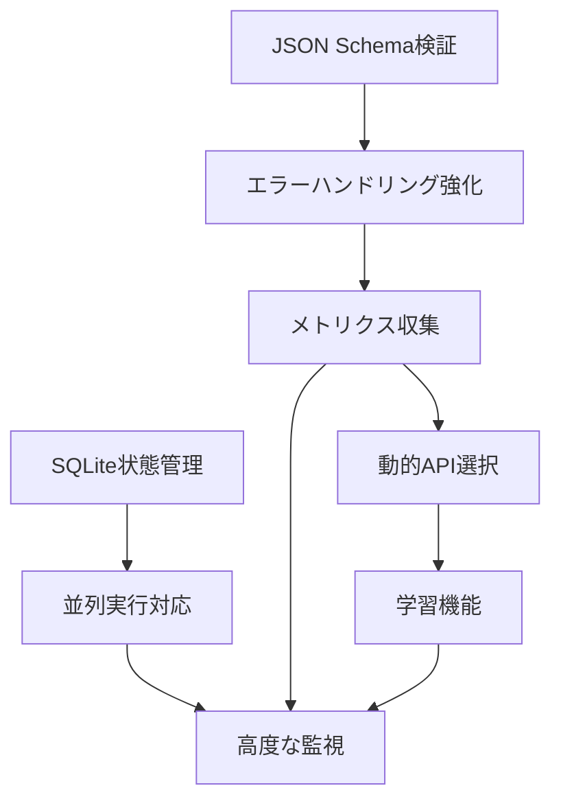

# 将来的な改善点・拡張計画

本ドキュメントは、AIコマンドエージェントシステムの将来的な改善点と拡張計画をまとめたものです。
現在の基本実装完了後に段階的に導入することを想定しています。
現在の基本実装においては考慮しないものとし、基本実装を優先してください。

## 1. 実装優先度別改善計画

### 高優先度（Phase 1: 基本システム安定化）

#### 1.1 JSON Schema検証の実装
**目的**: AI応答の構造保証によるシステム安定性向上

```python
# 実装例
import jsonschema

TASK_SCHEMA = {
    "type": "object",
    "required": ["task_summary", "domain_phases"],
    "properties": {
        "task_summary": {
            "type": "object",
            "required": ["id", "name", "what", "why", "how", "done_criteria"],
            # 詳細スキーマ定義
        },
        "domain_phases": {
            "type": "array",
            "items": {
                "type": "object",
                "required": ["no", "name", "type", "what", "why", "how", "done_criteria", "status"]
                # フェーズスキーマ定義
            }
        }
    }
}

class ResponseValidator:
    def validate_ai_response(self, response):
        try:
            jsonschema.validate(response, TASK_SCHEMA)
            return True
        except jsonschema.ValidationError as e:
            self.handle_validation_error(e)
            return False
```

**導入効果**:
- AI応答の一貫性保証
- システムエラーの早期検出
- デバッグ効率の向上

#### 1.2 エラーハンドリングの強化
**目的**: より詳細なエラー分類と適切な対応策の自動選択

```python
class EnhancedErrorHandler:
    ERROR_CATEGORIES = {
        'permission_denied': {
            'action': 'add_sudo_confirmation_phase',
            'description': 'sudo権限確認フェーズ追加'
        },
        'network_timeout': {
            'action': 'add_network_check_phase', 
            'description': 'ネットワーク設定確認フェーズ追加'
        },
        'dependency_missing': {
            'action': 'add_dependency_install_phase',
            'description': '依存関係インストールフェーズ追加'
        },
        'disk_space_full': {
            'action': 'add_cleanup_phase',
            'description': 'ディスク容量確保フェーズ追加'
        },
        'package_conflict': {
            'action': 'add_environment_analysis_phase',
            'description': '環境分析・競合解決フェーズ追加'
        }
    }
    
    def categorize_error(self, error_output, exit_code):
        """エラー出力から適切なカテゴリを判定"""
        error_patterns = {
            'permission_denied': [r'permission denied', r'access denied', r'sudo:'],
            'network_timeout': [r'timeout', r'network unreachable', r'connection refused'],
            'dependency_missing': [r'command not found', r'module not found', r'no such file'],
            'disk_space_full': [r'no space left', r'disk full'],
            'package_conflict': [r'conflict', r'incompatible', r'version mismatch']
        }
        
        for category, patterns in error_patterns.items():
            if any(re.search(pattern, error_output, re.IGNORECASE) for pattern in patterns):
                return category
        
        return 'unknown_error'
    
    def generate_recovery_phase(self, error_category, failed_phase):
        """エラーカテゴリに応じた回復フェーズを生成"""
        error_info = self.ERROR_CATEGORIES.get(error_category)
        if not error_info:
            return self.generate_generic_analysis_phase(failed_phase)
        
        # カテゴリ別の具体的な回復フェーズ生成ロジック
        return self.create_recovery_phase(error_info, failed_phase)
```

**導入効果**:
- エラー原因の自動特定
- 適切な回復戦略の自動選択
- 人的介入の削減

#### 1.3 コンテキスト認識型コマンド検証
**目的**: フェーズタイプに応じた動的セキュリティ検証

```python
class ContextAwareCommandValidator:
    def __init__(self):
        self.context_rules = {
            'preparation': {
                'allowed_commands': ['ls', 'cat', 'grep', 'find', 'which', 'ps', 'df'],
                'risk_level': 'low',
                'requires_sudo': False
            },
            'implementation': {
                'allowed_commands': ['pip', 'npm', 'docker', 'git', 'mkdir', 'cp', 'mv'],
                'risk_level': 'medium',
                'requires_sudo': True  # パッケージインストール等で必要
            },
            'validation': {
                'allowed_commands': ['curl', 'pytest', 'node', 'python', 'docker ps'],
                'risk_level': 'low',
                'requires_sudo': False
            }
        }
    
    def validate_with_context(self, command, phase_type, phase_content):
        """フェーズコンテキストを考慮したコマンド検証"""
        context = self.context_rules.get(phase_type, {})
        
        # フェーズタイプ別の基本検証
        if not self.is_command_allowed_for_phase(command, context):
            raise SecurityError(f"Command not allowed for {phase_type} phase: {command}")
        
        # フェーズ内容との整合性チェック
        if not self.is_command_consistent_with_content(command, phase_content):
            raise SecurityError(f"Command inconsistent with phase content: {command}")
        
        return True
```

**導入効果**:
- より精密なセキュリティ制御
- フェーズタイプに応じた適切な権限管理
- 意図しないコマンド実行の防止

### 中優先度（Phase 2: システム高度化）

#### 2.1 状態管理の改善（SQLite導入）
**目的**: JSONファイルより堅牢なデータ管理

```python
import sqlite3
from dataclasses import dataclass
from typing import List, Optional

@dataclass
class TaskState:
    id: str
    hierarchy_level: int
    parent_id: Optional[str]
    task_summary: dict
    domain_phases: List[dict]
    created_at: str
    updated_at: str
    status: str

class SQLiteTaskManager:
    def __init__(self, db_path="/workspace/data/tasks.db"):
        self.db_path = db_path
        self.init_database()
    
    def init_database(self):
        """データベース初期化"""
        conn = sqlite3.connect(self.db_path)
        cursor = conn.cursor()
        
        cursor.execute("""
            CREATE TABLE IF NOT EXISTS tasks (
                id TEXT PRIMARY KEY,
                hierarchy_level INTEGER,
                parent_id TEXT,
                task_summary TEXT,  -- JSON形式
                created_at TIMESTAMP DEFAULT CURRENT_TIMESTAMP,
                updated_at TIMESTAMP DEFAULT CURRENT_TIMESTAMP,
                status TEXT DEFAULT 'active'
            )
        """)
        
        cursor.execute("""
            CREATE TABLE IF NOT EXISTS phases (
                id INTEGER PRIMARY KEY AUTOINCREMENT,
                task_id TEXT,
                phase_no TEXT,
                name TEXT,
                type TEXT,
                content TEXT,  -- JSON形式
                status TEXT,
                response TEXT,
                created_at TIMESTAMP DEFAULT CURRENT_TIMESTAMP,
                updated_at TIMESTAMP DEFAULT CURRENT_TIMESTAMP,
                FOREIGN KEY (task_id) REFERENCES tasks (id)
            )
        """)
        
        cursor.execute("""
            CREATE TABLE IF NOT EXISTS execution_history (
                id INTEGER PRIMARY KEY AUTOINCREMENT,
                task_id TEXT,
                phase_id INTEGER,
                command TEXT,
                exit_code INTEGER,
                output TEXT,
                error_output TEXT,
                execution_time REAL,
                executed_at TIMESTAMP DEFAULT CURRENT_TIMESTAMP,
                FOREIGN KEY (task_id) REFERENCES tasks (id),
                FOREIGN KEY (phase_id) REFERENCES phases (id)
            )
        """)
        
        conn.commit()
        conn.close()
    
    def save_task_with_transaction(self, task_state: TaskState):
        """トランザクション付きタスク保存"""
        conn = sqlite3.connect(self.db_path)
        try:
            conn.execute("BEGIN TRANSACTION")
            # タスク保存ロジック
            conn.commit()
        except Exception as e:
            conn.rollback()
            raise e
        finally:
            conn.close()
```

**導入効果**:
- データ整合性の向上
- 並行アクセスの安全な処理
- 高度なクエリによる分析機能

#### 2.2 実行メトリクス収集機能
**目的**: システムパフォーマンスの可視化と最適化

```python
class TaskMetrics:
    def __init__(self):
        self.metrics_db = MetricsDatabase()
    
    def collect_phase_metrics(self, phase_execution):
        """フェーズ実行メトリクスの収集"""
        metrics = {
            'task_id': phase_execution.task_id,
            'phase_id': phase_execution.phase_id,
            'phase_type': phase_execution.phase_type,
            'execution_time': phase_execution.execution_time,
            'memory_usage': self.get_memory_usage(),
            'cpu_usage': self.get_cpu_usage(),
            'ai_api_calls': phase_execution.ai_api_calls,
            'ai_api_cost': phase_execution.ai_api_cost,
            'success_rate': self.calculate_success_rate(phase_execution.task_id),
            'retry_count': phase_execution.retry_count,
            'error_category': phase_execution.error_category
        }
        
        self.metrics_db.store_metrics(metrics)
        return metrics
    
    def generate_performance_report(self, time_range='7d'):
        """パフォーマンスレポート生成"""
        metrics = self.metrics_db.query_metrics(time_range)
        
        report = {
            'total_tasks': len(set(m['task_id'] for m in metrics)),
            'avg_execution_time': sum(m['execution_time'] for m in metrics) / len(metrics),
            'success_rate': sum(1 for m in metrics if m['success_rate'] > 0.8) / len(metrics),
            'top_error_categories': self.get_top_error_categories(metrics),
            'resource_utilization': self.calculate_resource_utilization(metrics),
            'cost_analysis': self.analyze_ai_api_costs(metrics)
        }
        
        return report
```

**導入効果**:
- システムパフォーマンスの定量的把握
- ボトルネック特定と改善方針決定
- コスト最適化の基礎データ

#### 2.3 API選択戦略の最適化
**目的**: コスト効率とレスポンス品質の動的バランス

```python
class DynamicAPISelector:
    def __init__(self):
        self.performance_history = {}
        self.cost_budgets = {
            'daily_limit': 50.0,  # $50/day
            'task_limit': 5.0     # $5/task
        }
    
    def select_optimal_api(self, task_type, phase_type, complexity_score):
        """最適なAPI選択"""
        candidates = [
            {
                'provider': 'openai',
                'model': 'gpt-4o',
                'cost_per_1k': 0.0025,
                'performance_score': self.get_performance_score('openai', 'gpt-4o'),
                'best_for': ['implementation', 'complex_analysis']
            },
            {
                'provider': 'anthropic', 
                'model': 'claude-3-5-sonnet-20241022',
                'cost_per_1k': 0.003,
                'performance_score': self.get_performance_score('anthropic', 'claude-3-5-sonnet'),
                'best_for': ['preparation', 'validation', 'planning']
            }
        ]
        
        # 現在のコスト使用状況をチェック
        current_usage = self.get_current_cost_usage()
        
        # フェーズタイプ別の最適化
        if phase_type in ['preparation', 'validation']:
            # 低コスト優先
            selected = min(candidates, key=lambda x: x['cost_per_1k'])
        elif complexity_score > 0.8:
            # 高性能優先
            selected = max(candidates, key=lambda x: x['performance_score'])
        else:
            # バランス重視
            selected = self.calculate_cost_performance_ratio(candidates)
        
        return selected
    
    def update_performance_score(self, provider, model, task_result):
        """パフォーマンススコアの更新"""
        key = f"{provider}:{model}"
        if key not in self.performance_history:
            self.performance_history[key] = []
        
        score = self.calculate_result_quality(task_result)
        self.performance_history[key].append(score)
        
        # 直近20回の平均を保持
        if len(self.performance_history[key]) > 20:
            self.performance_history[key] = self.performance_history[key][-20:]
```

**導入効果**:
- コスト効率の最大化
- タスクタイプ別の最適なAI選択
- 継続的な性能改善

### 低優先度（Phase 3: 高度な機能拡張）

#### 3.1 並列実行対応の設計準備
**目的**: 複数タスクの効率的な並列処理

```python
import asyncio
from concurrent.futures import ThreadPoolExecutor

class ParallelTaskManager:
    def __init__(self, max_workers=3):
        self.max_workers = max_workers
        self.executor = ThreadPoolExecutor(max_workers=max_workers)
        self.dependency_graph = DependencyGraph()
    
    async def execute_parallel_tasks(self, task_list):
        """依存関係を考慮した並列タスク実行"""
        # 依存関係分析
        execution_order = self.dependency_graph.topological_sort(task_list)
        
        # 並列実行可能なタスクグループに分割
        execution_groups = self.group_by_dependencies(execution_order)
        
        results = []
        for group in execution_groups:
            # 同一グループ内は並列実行
            group_tasks = [
                self.executor.submit(self.execute_single_task, task)
                for task in group
            ]
            
            # グループ完了を待機
            group_results = await asyncio.gather(*[
                asyncio.wrap_future(task) for task in group_tasks
            ])
            
            results.extend(group_results)
        
        return results

class DependencyGraph:
    def analyze_task_dependencies(self, task):
        """タスクの依存関係を分析"""
        dependencies = []
        
        # ファイル依存関係の検出
        file_deps = self.extract_file_dependencies(task)
        
        # サービス依存関係の検出  
        service_deps = self.extract_service_dependencies(task)
        
        # 環境依存関係の検出
        env_deps = self.extract_environment_dependencies(task)
        
        return dependencies
```

**導入効果**:
- 処理時間の大幅短縮
- リソース使用効率の向上
- 複雑なプロジェクトへの対応力強化

#### 3.2 学習機能とユーザーフィードバック
**目的**: 実行結果からの学習とパフォーマンス向上

```python
class LearningEngine:
    def __init__(self):
        self.feedback_history = FeedbackDatabase()
        self.pattern_analyzer = PatternAnalyzer()
    
    def collect_user_feedback(self, task_id, phase_id, feedback):
        """ユーザーフィードバックの収集"""
        feedback_data = {
            'task_id': task_id,
            'phase_id': phase_id,
            'user_satisfaction': feedback.get('satisfaction'),  # 1-5
            'effectiveness': feedback.get('effectiveness'),     # 1-5
            'comments': feedback.get('comments'),
            'suggested_improvements': feedback.get('improvements'),
            'timestamp': datetime.utcnow()
        }
        
        self.feedback_history.store(feedback_data)
        
        # リアルタイム学習の適用
        self.apply_immediate_learning(feedback_data)
    
    def analyze_success_patterns(self):
        """成功パターンの分析"""
        successful_tasks = self.feedback_history.get_high_rated_tasks()
        
        patterns = {
            'effective_phase_sequences': self.analyze_phase_sequences(successful_tasks),
            'optimal_command_patterns': self.analyze_command_patterns(successful_tasks),
            'context_specific_approaches': self.analyze_context_approaches(successful_tasks)
        }
        
        return patterns
    
    def generate_improvement_suggestions(self, current_task):
        """現在のタスクに対する改善提案"""
        similar_tasks = self.find_similar_successful_tasks(current_task)
        success_patterns = self.analyze_success_patterns()
        
        suggestions = []
        
        # フェーズ構成の改善提案
        if self.can_improve_phase_structure(current_task, success_patterns):
            suggestions.append(self.suggest_phase_improvements(current_task, success_patterns))
        
        # コマンド選択の改善提案  
        if self.can_improve_commands(current_task, success_patterns):
            suggestions.append(self.suggest_command_improvements(current_task, success_patterns))
        
        return suggestions
```

**導入効果**:
- システムの継続的改善
- ユーザー体験の向上
- ドメイン特化型の最適化

#### 3.3 高度な監視・観測機能
**目的**: システム全体の健全性と効率性の包括的監視

```python
class AdvancedMonitoring:
    def __init__(self):
        self.metrics_collector = MetricsCollector()
        self.anomaly_detector = AnomalyDetector()
        self.performance_analyzer = PerformanceAnalyzer()
    
    def setup_comprehensive_monitoring(self):
        """包括的な監視システムの設定"""
        # リアルタイムメトリクス
        self.setup_realtime_metrics()
        
        # 異常検知
        self.setup_anomaly_detection()
        
        # パフォーマンス分析
        self.setup_performance_analysis()
        
        # 予測的監視
        self.setup_predictive_monitoring()
    
    def generate_health_dashboard(self):
        """ヘルスダッシュボードの生成"""
        dashboard_data = {
            'system_health': {
                'overall_status': self.calculate_overall_health(),
                'active_tasks': self.get_active_task_count(),
                'success_rate_24h': self.calculate_success_rate('24h'),
                'avg_response_time': self.calculate_avg_response_time(),
                'resource_utilization': self.get_resource_utilization()
            },
            'ai_api_metrics': {
                'api_latency': self.get_api_latency_stats(),
                'cost_trends': self.get_cost_trends(),
                'error_rates': self.get_api_error_rates(),
                'quota_utilization': self.get_quota_utilization()
            },
            'security_metrics': {
                'blocked_commands': self.get_blocked_command_count(),
                'permission_escalations': self.get_permission_escalation_count(),
                'suspicious_activity': self.get_suspicious_activity_alerts()
            },
            'performance_insights': {
                'bottlenecks': self.identify_performance_bottlenecks(),
                'optimization_opportunities': self.identify_optimization_opportunities(),
                'capacity_planning': self.generate_capacity_recommendations()
            }
        }
        
        return dashboard_data
```

**導入効果**:
- プロアクティブな問題対応
- システム最適化の継続的実施
- 運用効率の向上

## 2. 段階的導入計画

### Phase 1: 基本システム安定化（1-2ヶ月）
1. JSON Schema検証の実装
2. エラーハンドリング強化
3. コンテキスト認識型セキュリティ

### Phase 2: システム高度化（2-3ヶ月）
1. SQLite状態管理導入
2. メトリクス収集システム
3. 動的API選択機能

### Phase 3: 高度な機能拡張（3-6ヶ月）
1. 並列実行対応
2. 学習機能とフィードバックシステム  
3. 高度な監視・観測機能

## 3. 各改善の相互依存関係



## 4. 導入時の注意点

### 4.1 後方互換性の維持
- 既存のJSON形式データとの互換性確保
- 段階的移行による運用継続性の保証

### 4.2 リソース要件の考慮
- 各機能の追加によるメモリ・CPU使用量増加
- ストレージ要件の拡大（特にメトリクス保存）

### 4.3 セキュリティ要件の見直し
- 新機能による新たなセキュリティリスクの評価
- 権限管理の複雑化への対応

## 5. 成果測定指標

### 5.1 技術指標
- システム応答時間の短縮率
- エラー発生率の減少
- API コスト効率の改善

### 5.2 ユーザー体験指標
- タスク完了率の向上
- ユーザー満足度スコア
- 手動介入回数の削減

### 5.3 運用指標
- システム稼働率
- 保守作業時間の削減
- インシデント対応時間の短縮

この段階的な改善計画により、AIコマンドエージェントシステムは継続的に進化し、より高度で効率的なシステムへと発展していきます。