# AIコマンドエージェント構成仕様書 v1.0

本ドキュメントは、Slack と AI API を介してソースコードの生成・リファクタリング・環境構築といったプログラミング関連タスクを自律的に実行可能なAIエージェントの構成と仕様をまとめたものです。

## システム概要

本システムは、Slackインターフェースを通じてユーザーからタスクを受け取り、AI（Claude/GPT）が自律的にタスク分解・計画立案・実行・評価を行う自己完結型エージェントシステムです。

---

## 📁 アーキテクチャ構成概要

### 構成要素一覧

| 要素         | 内容                                                              |
| ------------ | ----------------------------------------------------------------- |
| UI           | Slack（チャットUI兼メッセージ中継）                               |
| AIエンジン   | AI API（function callingを活用）                                  |
| エージェント | Python + Slack Bolt + Executor構成（AI による実行を担う自律主体） |
| 中継通信     | SLack の Socket mode（ローカル → Slack）                          |
| 実行環境     | WSL2 + Docker Compose（Ubuntuベース）                             |
| 履歴管理     | JSON形式でのタスク設計／結果ログをそのまま保存                    |

### アーキテクチャ構成

```mermaid
sequenceDiagram
    participant S as Slack
    participant A as Agent
    participant TM as Task Manager
    participant AI as AI APIs
    participant E as Executor

    S->>A: mention/DM
    A->>TM: タスク受付
    Note over AI: 計画時は Planner 役 AI
    TM->>AI: 初期計画（フェーズに分解）
    AI-->>TM: JSON計画書

    rect rgb(30, 60, 60)
        Note over TM,E: LOOP: pending フェーズが存在する間
        
        Note over AI: 評価時は Manager 役 AI
        TM->>AI: フェーズ評価要求
        AI-->>TM: 評価結果
        
        alt 実行可能なフェーズの場合
            TM->>E: コマンド実行
            E-->>TM: 実行結果
        else さらに細かく分類に分解、フェーズ化が可能な場合（階層は深化する）
            Note over AI: 計画時は Planner 役 AI
            TM->>AI: 分類・分解（フェーズ化）要求
            AI-->>TM: 下位計画書
            Note over TM: 階層数チェック
            alt 5層目
                TM->>A: ユーザー確認要求
                A->>S: 継続確認メッセージ
                S-->>A: yes/no応答
                A-->>TM: 確認結果
            else 8層目
                TM->>A: 強制停止通知
                A->>S: 停止メッセージ
                Note over TM: ループ終了
            end
        end
        
        Note over AI: 評価時は Manager 役 AI
        TM->>AI: 結果評価・状態更新
        AI-->>TM: 更新後の計画書
    end

    TM->>A: 完了報告
    A->>S: 結果通知
```

### コンポーネント詳細

#### Slack Agent
- **役割**: ユーザーインターフェース層
- **機能**:
  - Slackメンション/DMの受信
  - タスクの受付と初期解析
  - 実行結果のフィードバック表示

#### Task Manager
- **役割**: タスク管理と再帰的実行制御
- **機能**:
  - AI APIへのタスク計画要求
  - フェーズ単位での実行管理
  - 階層的タスク分解（最大8層）
  - 実行結果の評価とフィードバック

#### AI APIs Integration
- **役割**: 知的処理エンジン
- **プロンプト種別**:
  - Planner: 初期タスク分解と計画立案
  - Manager: 実行結果の評価と再計画
  - Executor: 具体的コマンド生成

#### Docker Executor
- **役割**: 安全な実行環境
- **機能**:
  - コマンドの隔離実行
  - ファイルシステムの保護
  - 実行結果の収集

### データフロー

1. **タスク受付**: Slack → Agent → Task Manager
2. **計画立案**: Task Manager → AI Planner → JSON計画書
3. **実行ループ**:
   - pending フェーズの抽出
   - 階層的分解（必要に応じて）
   - コマンド実行
   - 結果評価（AI Manager）
4. **完了報告**: Task Manager → Agent → Slack

### セキュリティ考慮事項

- **実行権限の制限**: Docker内での実行ユーザー権限を最小化
    ただし必要に応じて DB 構築、llama 導入などアプリケーションの構築と利用が必要
- **ディレクトリアクセス制御**: マウント領域外へのアクセス禁止
- **コマンドインジェクション対策**: AI生成コマンドの検証機構
- **認証**: Slack署名検証によるリクエスト認証

### スケーラビリティ

- **並列実行**: なし。単一タスクの逐次実行のみで並列処理は行わない
- **永続化**: タスク状態の JSON 保存による中断・再開機能
- **API制限**: タイムアウト時の再試行機構（5分待機）

### その他

1. **データベース**: 現状はJSON形式でのファイル保存を仮定
    ※ このシステムにより実行されるタスク遂行に必要なデータベースの導入等に環境やセキュリティ以外の制限はないことに注意。
    ※ AI は必要に応じてデータベースを構築し運用を行う。
2. **認証方式**: Slack OAuth以外の追加認証は不要
3. **ログ保存期間**: 90日間の保持
4. **エラー通知**: Slackへの直接通知のみ

---

## 🧹 モジュール構成

### 1. Slack連携ボット

* Slack Appを作成し、OAuthスコープ（app\_mentions\:read, chat\:writeなど）を設定
* Socket Mode対応で `xoxb-...`, `xapp-...` トークンを用いる
* `slack-agent/app.py` にて `slack_bolt.App` を起動し、メンションイベントに反応

### 2. 実行クライアント（executor\_client.py）

* メッセージからタスク解釈 → AI API に送信 → コマンドを生成
* 実行コマンドがあれば `os.popen()` 経由で実行し、その結果をSlackへ返信
* 開発時は `eval()` 使用だが、本番では `json.loads()` 推奨

### 3. Docker環境

* Slackボットごとにコンテナ化（ポート3000で待機）
* `.env`ファイルにより、環境変数やマウント先（PROJECT\_PATH, PROJECT\_DIRなど）を切替

---

## 🔄 実行と再復処理構造

AIは再復的処理自体は行いませんが、**構造的な再復性**を以下の方法により実現します：

### 📐 再復的タスク分割手法

1. タスクと設計者プロンプトを AI API に送信
2. AI API は、フェーズ構成を含む計画書（JSON）を出力
3. その中から `status: "pending"` かつ `no` が最小のフェーズを抽出
4. 抽出されたフェーズを**下層の新たなタスク**として、改めて AI API  に投げる
   * `task_summary.id` は `task-20250611050100_1_2` のように階層を `_` で接続
   * 下層には `user_input`, `value_priority` は引き継ぐず空に
   * その他キー（what, why, howなど）は上層フェーズの値を引き継ぐ
   * 一旦停止が判定される階層数は5で、5層目に exec が空のフェーズが見つかった場合、システム側が対象の json を slack に投げてユーザーへ継続の yes/no 診断を仰ぎ「yes」文言を待つ。yes の回答が含まれていた回答がある場合は続行する。
   * 完全停止の最大階層数は 8 で、8 層目に exec が空のフェーズが見つかった場合、システム側が対象の json を slack に投げてユーザーへ停止報告を行う。
5. APIから下層の計画書が返る
6. 実行可能な `exec` または `how` を持つフェーズになれば、コマンド実行を行い結果を記録
7. 実行後、下層の調整・更新エージェントが計画を更新
8. フェーズ完了とともに、上層へ報告されることで「再復的実行」が完結

この流れを繰り返すことで、システムは**再復的実行と自己計画のPDCAループ**を保持したまま自律的に作業を運用します。

---

## 📦 プロトコルとファイル仕様

### .env.example

* SLACK\_BOT\_TOKEN, API\_KEY などの認証情報
* プロジェクトディレクトリの絶対パスとマウントポイント（PROJECT\_PATH, PROJECT\_DIR）

---

## ✅ 今後の拡張提案（オプション）

* コマンド実行の履歴をMarkdownまたはSQLiteで保存
* Slack以外（Discord/Misskey）へのインターフェース拡張
* 実行結果からAIが評価と次アクション提案まで含める「自己ループ構造」
* Docker内で完全隔離した executor（Shell Injection 対策）
