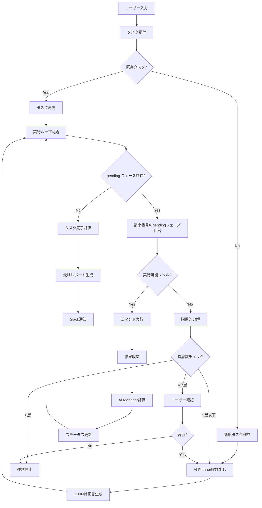

# タスク実行フロー設計書

## 1. タスク実行の基本フロー



## 2. 階層ID管理システム

### 2.1 階層ID構造
階層IDは「_」区切りで階層を表現し、以下の規則に従います：

```
第1層（ルートタスク）: task-20250621123000
第2層: task-20250621123000_1
第3層: task-20250621123000_1_2  
第4層: task-20250621123000_1_2_3
第5層: task-20250621123000_1_2_3_4
```

### 2.2 階層管理クラス
```python
class HierarchyManager:
    @staticmethod
    def get_hierarchy_level(task_id):
        """階層レベルを取得（1から開始）"""
        if task_id.startswith('task-'):
            parts = task_id.split('_')
            return len(parts)  # task-xxx = 1層, task-xxx_1 = 2層
        return 0
    
    @staticmethod
    def get_parent_id(task_id):
        """親タスクIDを取得"""
        parts = task_id.split('_')
        if len(parts) <= 1:
            return None  # ルートタスクには親がない
        return '_'.join(parts[:-1])
    
    @staticmethod
    def create_child_id(parent_id, child_number):
        """子タスクIDを生成"""
        return f"{parent_id}_{child_number}"
    
    @staticmethod
    def get_root_id(task_id):
        """ルートタスクIDを取得"""
        return task_id.split('_')[0]
    
    @staticmethod
    def should_request_user_confirmation(task_id):
        """ユーザー確認が必要な階層かチェック（5層目）"""
        return HierarchyManager.get_hierarchy_level(task_id) == 5
    
    @staticmethod
    def should_force_stop(task_id):
        """強制停止が必要な階層かチェック（8層目）"""
        return HierarchyManager.get_hierarchy_level(task_id) >= 8

# 使用例
task_id = "task-20250621123000_1_2"
level = HierarchyManager.get_hierarchy_level(task_id)  # 3
parent = HierarchyManager.get_parent_id(task_id)       # "task-20250621123000_1"
child = HierarchyManager.create_child_id(task_id, 1)   # "task-20250621123000_1_2_1"
```

### 2.3 階層制御フロー
```python
def process_phase_decomposition(phase, current_task_id):
    """フェーズの階層的分解処理"""
    hierarchy_level = HierarchyManager.get_hierarchy_level(current_task_id)
    
    if hierarchy_level >= 8:
        # 8層目：強制停止
        send_slack_message(f"階層制限に達しました。タスクを停止します: {current_task_id}")
        return None
    
    elif hierarchy_level == 5:
        # 5層目：ユーザー確認
        confirmation = request_user_confirmation(current_task_id, phase)
        if not confirmation:
            send_slack_message(f"ユーザーによりタスクが停止されました: {current_task_id}")
            return None
    
    # 新しい階層でのタスク分解実行
    child_task_id = HierarchyManager.create_child_id(current_task_id, 1)
    return decompose_phase_to_subtask(phase, child_task_id)
```

## 3. 再帰的タスク分解メカニズム

### 3.1 情報継承ルール
階層分解時の情報継承は以下の通り：

```python
def inherit_task_info(parent_phase, parent_task):
    """親フェーズから子タスクへの情報継承"""
    child_task_summary = {
        "id": child_task_id,  # 新規生成
        "user_input": [],     # 空にリセット
        "name": parent_phase.get("name"),
        "what": parent_phase.get("what"),
        "why": parent_phase.get("why"), 
        "how": parent_phase.get("how"),
        "done_criteria": parent_phase.get("done_criteria"),
        "value_priority": "",  # 空にリセット
        "evaluation": "",      # 新規
        "result": ""          # 新規
    }
    return child_task_summary
```

### 3.2 フェーズ分解判定
```python
def should_decompose_phase(phase):
    """フェーズが階層的分解を必要とするかの判定"""
    # execフィールドに実行可能コマンドが存在する場合は実行可能
    if phase.get('exec') and phase['exec'].strip():
        return False
    
    # howが具体的な単一コマンドを示している場合は実行可能
    how_content = phase.get('how', '')
    if is_single_executable_command(how_content):
        return False
    
    # それ以外は階層的分解が必要
    return True

def is_single_executable_command(text):
    """テキストが単一の実行可能コマンドかどうか判定"""
    # 簡単な判定ロジック（実装時に詳細化）
    command_patterns = [
        r'^[a-zA-Z0-9_-]+\s+.*$',  # コマンド名 + 引数
        r'^cd\s+.*$',              # cd コマンド
        r'^mkdir\s+.*$',           # mkdir コマンド
        # 他のコマンドパターンを追加
    ]
    
    for pattern in command_patterns:
        if re.match(pattern, text.strip()):
            return True
    return False
```

## 4. フェーズ実行詳細

### 4.1 フェーズタイプと実行パターン

| タイプ | 目的 | 実行内容例 | 階層分解の可能性 |
|--------|------|------------|------------------|
| preparation | 事前準備・調査 | `ls -la`, `which python`, `cat requirements.txt` | 低 |
| implementation | 実装・構築 | `pip install`, `docker build`, `git clone` | 高 |
| validation | 検証・確認 | `pytest`, `curl localhost`, `docker ps` | 低 |

### 4.2 実行ループの詳細制御
```python
def execute_task_loop(task_id):
    """タスク実行の主ループ"""
    while True:
        task_data = load_task_data(task_id)
        pending_phases = get_pending_phases(task_data)
        
        if not pending_phases:
            # 全フェーズ完了
            finalize_task(task_id)
            break
        
        # 最小番号のpendingフェーズを取得
        current_phase = min(pending_phases, key=lambda p: int(p['no']))
        
        if should_decompose_phase(current_phase):
            # 階層的分解が必要
            if HierarchyManager.should_force_stop(task_id):
                force_stop_task(task_id)
                break
            elif HierarchyManager.should_request_user_confirmation(task_id):
                if not request_user_confirmation(task_id, current_phase):
                    stop_task(task_id)
                    break
            
            # 子タスクとして分解
            child_task_id = decompose_phase_to_subtask(current_phase, task_id)
            execute_task_loop(child_task_id)  # 再帰実行
        else:
            # 直接実行可能
            execute_phase(current_phase, task_id)
            
        # AI Manager による評価と状態更新
        update_task_with_ai_evaluation(task_id)
```

## 5. 状態遷移と評価

### 5.1 フェーズステータス遷移
```
pending → done: 正常完了
pending → failed: 実行失敗  
pending → canceled: 不要と判断
done/failed/canceled: 変更不可（履歴保持）
```

### 5.2 階層間の状態伝播
```python
def propagate_child_result_to_parent(child_task_id, child_result):
    """子タスクの結果を親フェーズに反映"""
    parent_id = HierarchyManager.get_parent_id(child_task_id)
    if not parent_id:
        return  # ルートタスクの場合は何もしない
    
    parent_task = load_task_data(parent_id)
    
    # 対応する親フェーズを見つけて結果を更新
    for phase in parent_task['domain_phases']:
        if phase['status'] == 'pending' and corresponds_to_child_task(phase, child_task_id):
            phase['response'] = format_child_task_summary(child_result)
            phase['status'] = 'change_status'  # Manager による再評価を促す
            break
    
    save_task_data(parent_id, parent_task)
```

## 6. エラーハンドリング

### 6.1 階層別エラー対応
- **浅い階層（1-3層）**: 積極的な再試行と代替手段の提案
- **深い階層（4-6層）**: 慎重な原因分析とユーザー確認
- **制限階層（7-8層）**: 最小限の操作で安全に停止

### 6.2 無限ループ防止強化
```python
class LoopDetector:
    def __init__(self):
        self.phase_execution_history = defaultdict(int)
        self.failed_patterns = []
    
    def check_infinite_loop(self, task_id, phase):
        """無限ループ検出"""
        key = f"{task_id}:{phase['name']}"
        self.phase_execution_history[key] += 1
        
        if self.phase_execution_history[key] >= 3:
            # 同一フェーズ3回失敗
            return True
        
        hierarchy_level = HierarchyManager.get_hierarchy_level(task_id)
        if hierarchy_level >= 6:
            # 深い階層での繰り返し
            return True
        
        return False
```

## 7. パフォーマンス最適化

### 7.1 階層データの効率的管理
- 各階層のタスクデータは個別ファイルで管理
- 親子関係のインデックス管理
- 不要になった深い階層データの自動クリーンアップ

### 7.2 メモリ使用量の制御
```python
def cleanup_completed_hierarchies(root_task_id):
    """完了した階層の不要データをクリーンアップ"""
    # 完了したタスクの深い階層データを圧縮保存
    # メモリ使用量を制御
    pass
```
